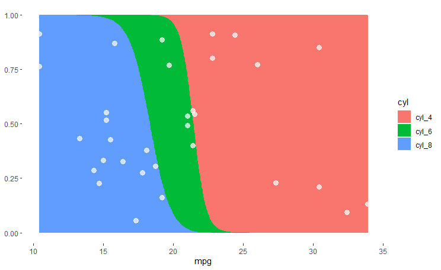
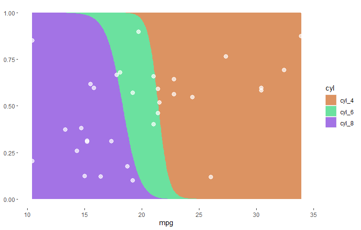

<!-- badges: start -->
[](https://github.com/raeslab/loreplotr/actions/workflows/R-CMD-check.yaml)
<!-- badges: end -->

# LoreplotR - Logistic Regression Plots in R

LoreplotR is an R package to draw Logistic Regression plots, which compare the prevalence of different categories with a specific feature. This type of visualization was used in Vieira-Silva *et al.* [Statin therapy is associated with lower prevalence of gut microbiota dysbiosis](https://www.nature.com/articles/s41586-020-2269-x) to show that the frequency of a specific gut composition, aka. an enterotype, increases along with an increasing Body Mass Index. 

If you prefer a Python implementation, have a look at [lorepy](https://github.com/raeslab/lorepy)


## Setup

LoreplotR needs to be installed directly from GitHub using devtools. From an R console enter the commands below.


```commandline
library(devtools)
install_github("raeslab/loreplotr")
```

If you are using ```renv```, instead use the commands below to install this package.

```commandline
renv::install("raeslab/loreplotr")
```


## Example

LoreplotR needs to be passed a dataframe, the (numerical) feature to plot on the x-axis and the (categorical) feature for the y-axis. There is one optional parameter ```draw_dots``` which allows you to show/hide dots indicating where individual samples included in the dataframe are located in the plot.

```R
library(dplyr)
library(loreplotr)

data("mtcars")

mtcars$cyl <- paste("cyl", mtcars$cyl, sep="_")

t <- mtcars %>% loreplotr("mpg", "cyl", draw_dots=TRUE)
t

```



As LoreplotR is built upon ggplot2, customization is possible using functions from the [ggplot2](https://ggplot2.tidyverse.org/) package. E.g. using the function ```scale_fill_manual``` a custom color palette can be selected.


```R
library(dplyr)
library(loreplotr)
library(ggplot2)

data("mtcars")

mtcars$cyl <- paste("cyl", mtcars$cyl, sep="_")

t <- mtcars %>% loreplotr("mpg", "cyl")

t <- t + scale_fill_manual(values = c("#DC9362", "#6BE19F", "#A373E5"))
t
```

