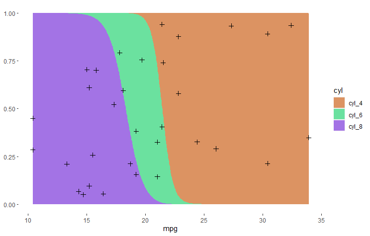

<!-- badges: start -->
[](https://github.com/raeslab/loreplotr/actions/workflows/R-CMD-check.yaml) [](https://creativecommons.org/licenses/by-nc-sa/4.0/)
<!-- badges: end -->

# LoreplotR - Logistic Regression Plots in R

LoreplotR is an R package to draw Logistic Regression plots, which compare the prevalence of different categories with a specific feature. This type of visualization was used in Vieira-Silva *et al.* [Statin therapy is associated with lower prevalence of gut microbiota dysbiosis](https://www.nature.com/articles/s41586-020-2269-x) to show that the frequency of a specific gut composition, aka. an enterotype, increases along with an increasing Body Mass Index. 

If you prefer a Python implementation, have a look at [lorepy](https://github.com/raeslab/lorepy)


## Setup

LoreplotR needs to be installed directly from GitHub using devtools. From an R console enter the commands below.


```commandline
library(devtools)
install_github("raeslab/loreplotr")
```

If you are using ```renv```, instead use the commands below to install this package.

```commandline
renv::install("raeslab/loreplotr")
```

## Usage

LoreplotR needs to be passed a dataframe, the (numerical) feature to plot on the x-axis and the (categorical) feature for the y-axis. There is one optional parameter ```draw_dots``` which allows you to show/hide dots indicating where individual samples included in the dataframe are located in the plot. The package will return a ```ggplot2``` plot
which can be saved/changed using functions from that library.


### Example

Below is an example that shows data from the ```mtcars``` dataset and highlights how the proportions of cars with a different number of cylinders changes in function of fuel efficiency (here included as mile per gallon, mpg).

```R
library(dplyr)
library(loreplotr)

data("mtcars")

mtcars$cyl <- paste("cyl", mtcars$cyl, sep="_")

t <- mtcars %>% loreplotr("mpg", "cyl", draw_dots=TRUE)
t

```


As LoreplotR is built upon ggplot2, customization is possible using functions from the [ggplot2](https://ggplot2.tidyverse.org/) package. E.g. using the function ```scale_fill_manual``` a custom color palette can be selected.


```R
library(dplyr)
library(loreplotr)
library(ggplot2)

data("mtcars")

mtcars$cyl <- paste("cyl", mtcars$cyl, sep="_")

t <- mtcars %>% loreplotr("mpg", "cyl")

t <- t + scale_fill_manual(values = c("#DC9362", "#6BE19F", "#A373E5"))
t
```


To change the appearance of the dots, loreplotr exposes the size, shape, fill, colour and alpha parameters through `dots_size`, `dots_shape`,`dots_fill`,`dots_colour` and,`dots_alpha` respectively. 

```R
library(dplyr)
library(ggplot2)
library(loreplotr)

data("mtcars")

mtcars$cyl <- paste("cyl", mtcars$cyl, sep="_")

t <- mtcars %>% loreplotr("mpg", "cyl", dots_colour="black", dots_size=2, dots_alpha = 1, dots_shape=3)
t

t <- t + scale_fill_manual(values = c("#DC9362", "#6BE19F", "#A373E5"))
t
```

Support for two classes is now partially implemented, though the classes need to be converted to 0 and 1 for the plot to work! (Note that dots currently aren't show when using two classes)

```R
library(dplyr)
library(ggplot2)
library(loreplotr)

data("mtcars")

mtcars$cyl <- paste("cyl", mtcars$cyl, sep="_")

mtcars$cyl <- gsub("cyl_4", 0, mtcars$cyl)
mtcars$cyl <- gsub("cyl_6", 0, mtcars$cyl)
mtcars$cyl <- gsub("cyl_8", 1, mtcars$cyl)

mtcars$cyl <- as.numeric(mtcars$cyl)

t <- mtcars %>% loreplotr("mpg", "cyl")
t

t <- t + scale_fill_manual(values = c("#DC9362", "#6BE19F"))
t
```



## Troubleshooting/FAQ

* **Why do my category labels change, with spaces replaced by dots and numbers preceded by an 'X'?** This occurs because R imposes specific rules on valid column names. Invalid characters in column names are replaced with dots, and numbers at the start are prefixed with 'X'. This is detailed in the [make.names function](https://stat.ethz.ch/R-manual/R-devel/library/base/html/make.names.html). Since loreplotr includes a step that necessitates creating a dataframe with a column for each group, label modifications occur. It's best to use valid labels whenever possible. If not feasible, consider using ggplot2's `scale_fill_discrete` or `scale_fill_manual` to adjust legend labels.

## Contributing

Any contributions you make are **greatly appreciated**.

  * Found a bug or have some suggestions? Open an [issue](https://github.com/raeslab/loreplotr/issues).
  * Pull requests are welcome! Though open an [issue](https://github.com/raeslab/loreplotr/issues) first to discuss which features/changes you wish to implement.

## Contact and License

loreplotR was developed by [Sebastian Proost](https://sebastian.proost.science/) at the [RaesLab](https://raeslab.sites.vib.be/en) (part of [VIB](https://vib.be/en#/) and [KULeuven](https://www.kuleuven.be/english/kuleuven/index.html))and was adopted from code written by [Sara Vieira-Silva](https://saravsilva.github.io/). loreplotR is available under the [Creative Commons Attribution-NonCommercial-ShareAlike 4.0 International](https://creativecommons.org/licenses/by-nc-sa/4.0/) license.

